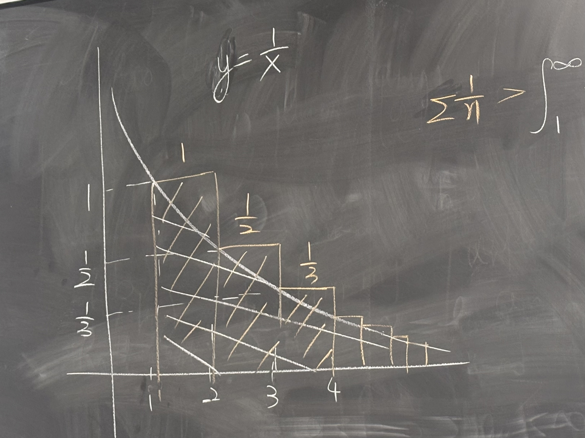

********
- Series and convergence of series
- Integral test, alternating series test
****
# Series
>[!definition]
>Let $\{x_n\}_{n\in\mathbb{N}}$ be a sequence. For each $N\in\mathbb{N}$, we write
>$$S_N=\sum_{n=1}^N x_n=x_1+x_2+\dots+x_N$$
>and we call $S_N$ the **partial sum**. If $\{S_N\}_{N\in\mathbb{N}}$ is convergent, then we write
>$$\sum_{n=1}^\infty x_n=\lim_{N\rightarrow\infty}S_N=\lim_{N\rightarrow\infty}\left(\sum_{n=1}^\infty x_n\right)$$
>and we call $\sum_{n=1}^\infty x_n$ a **series**, if the above case (i.e. $\{S_N\}$ is convergent), we say $\sum_{n=1}^\infty x_n$ is **convergent**, otherwise we say $\sum_{n=1}^\infty x_n$ is **divergent** and does not represent any number.

*ex. 1* 
$$\sum_{n=1}^\infty 2^{-n}=\sum_{n=1}^\infty \frac{1}{2^n}=\frac{1}{2}+\frac{1}{4}+\frac{1}{8}+\dots$$
Is this convergent?
We want to look at the partial sums of the series, and if the partial sums *as a sequence* converge, then the series is convergent.
Partial sum: $S_N=\sum_{n=1}^N2^{-n}$
*Claim:* $S_N=1-2^{-N}$ for any $N\in\mathbb{N}$
Proof by induction on $N$.
*Base case:* $N=1$, $S_1=\frac{1}{2}=1-2^{-1}$
*Induction case:* Suppose $N=k$ is true. Then $S_k=1-2^{-k}$
$$
\begin{align}
S_{k+1}=\sum_{n=1}^{k+1}2^{-n}
&=S_k+2^{-(k+1)}\\
&=1-2^{-k}+2^{-(k+1)}\\
&=1-(2^{-k}-2^{-(k+1)})\\
&=1-2^{-(k+1)}(2-1)\\
&=1-2^{-(k+1)}
\end{align}$$
Therefore $S_N=1-2^{-N}$ $\forall N\in\mathbb{N}$.
Since $\lim_{N\rightarrow\infty}S_N=1-(\lim_{N\rightarrow\infty} 2^{-N})=1=\sum_{n=1}^\infty 2^{-n}$.

*ex. 2* geometric series
$\sum_{n=0}^\infty r^n$ for $r\in\mathbb{R}$
Is this convergent?
Claim: $S_N=\sum_{n=0}^N r^n=\frac{1-r^{N=1}}{1-r}$ if $r\in(-1,1)$
Proof by induction:
*Base case:* $N=0$
$S_0=r^0=1=\frac{1-r^{0+1}}{1-r}=1$
*Inductive step:* Assume $N+k$ is true ($S_k=\frac{1-r^{k+1}}{1-r}$)
Then
$$\begin{align}S_{k+1}=S_k+r^{k+1}=\frac{1-r^{k+1}}{1-r}+r^{k+1}&=\frac{1-r^{k+1}}{1-r}+\frac{r^{k+1}(1-r)}{1-r}\\&=\frac{1-r^{k+1}+r^{k+1}-r^{k+2}}{1-r}\\&=\frac{1-r^{k+2}}{1-r}
\end{align}$$
Therefore $S_N=\frac{1-r^{N+1}}{1-r}$.
Since $|r|<1$, $\lim_{N\rightarrow\infty}|r|^{N+i}=0$ and hence
$$\lim_{N\rightarrow\infty}S_N=\lim_{N\rightarrow\infty}\frac{1-r^{N+1}}{1-r}=\frac{1}{1-r}$$
Conclusion:
$$\sum_{n=0}^\infty r^n=\frac{1}{1-r}$$ if $|r|<1$.

## Convergence of a series
Question: $\sum_{n=1}^\infty x_n$ is convergent iff $\{s_N=\sum_{n=1}^N x_n\}_{N\in\mathbb{N}}$ is convergent iff $\{s_N\}$ is a Cauchy sequence. How do we describe $\{s_N\}$ being Cauchy in terms of $\sum X_n$?
Recall that $\{S_N\}$ is Cauchy if $\forall\varepsilon>0$, $\exists M\in\mathbb{N}$ s.t. $|s_n-s_m|<\varepsilon$ $\forall n,m\geq M$.
Note $s_n-s_m=\sum_{k=1}^n x_k-\sum_{k=1}^m x_k=\sum_{k=m+1}^n x_k$.
Thus $\{s_N\}$ is Cauchy iff $\forall\varepsilon>0$, $\exists N\in\mathbb{N}$ s.t. $\forall n,m\geq N$, we have $\left|\sum_{k=m}^n x_k\right|<\varepsilon$.
>[!theorem]
>$\sum_{k=1}^\infty x_k$ is convergent if and only if it satisfies the **Cauchy criterion:** $\forall\varepsilon>0$, $\exists N\in\mathbb{N}$ s.t.
>$$\left|\sum_{k=n}^m x_k\right|<\varepsilon\quad\forall m>n\geq N$$

*The Cauchy criterion means a sequence $(s_n)$ of partial sums is Cauchy sequence:*
for each $\varepsilon>0$ there exists $N$ such that $m,n>N$ implies $|s_n-s_m|<\varepsilon$

>[!theorem] Corollary
>If $\sum_{k=1}^\infty x_k$ is convergent, then $\lim_{k\rightarrow\infty} x_k=0$.

*Remark:* $\lim_{k\rightarrow\infty} x_k=0$ does **not** imply $\sum_{k=1}^\infty x_k$ is convergent. (e.g. $x_k=\frac{1}{k}$)

>[!theorem] Theorem (Comparison test)
>Let $\sum x_n$ be a convergent series with $x_n\geq0\enspace\forall n\in\mathbb{N}$. If $$|y_n|\leq x_n\quad\forall n\in\mathbb{N},$$ then $\sum y_n$ is convergent.

*Similar to the squeeze theorem, we are using $x_n$ to "control" $y_n$.*

***Proof.*** Note
$$\left|\sum_{k=m}^n y_k\right|\leq \sum_{k=m}^n |y_k|\leq \sum_{k=m}^n x_k$$
since $\sum x_k$ is convergent, it must satisfy the Cauchy criterion. 
By this inequality, $\sum y_k$ also satisfies the Cauchy criterion and hence is convergent.

>[!definition]
>$\sum x_n$ **converges absolutely** if $\sum_{n=1}^\infty|x_n|$ is convergent.

*Add an absolute value to a convergent sequence and it is still convergent.*
*absolute convergence $\implies$ convergence*
$$\left|\sum_{n=k}^m x_n\right|\leq\sum_{n=k}^m|x_n|$$
*by applying the triangle inequality and the Cauchy criterion. However,*
*convergence $\nRightarrow$ absolute convergence*
*Take for example $\sum\frac{(-1)^n}{n}$, convergent but not absolutely convergent*

>[!theorem] Theorem (Ratio Test)
>Let $\sum a_n$ be a series.
>i.) If $$\limsup_{n\rightarrow\infty}\left|\frac{a_{n+1}}{a_n}\right|<1,$$ then $\sum|a_n|<\infty$ (i.e. $\sum a_n$ is absolutely convergent, since each term is less than the previous term.)
>$\quad$
>ii.) If $$\liminf_{n\rightarrow\infty}\left|\frac{a_{n+1}}{a_n}\right|>1,$$ then $\sum a_n$ is divergent.

- *The reason we use $\limsup$ and $\liminf$ instead of just the $\lim$ because we don't know for certain that there is a limit, e.g. $\left|\frac{a_{n+1}}{a_n}\right|$ may be divergent.*
- *i.) is roughly saying that $|a_{n+1}|<|a_n|$, ii.) $\approx|a_{n+1|}>|a_n|$. If it is $=1$, though, we can't conclude anything.*

*Remark.* When $\alpha=1$, nothing can be said:
$$\sum_{n=1}^\infty\frac{1}{n}\quad\text{is divergent,}\quad\sum \frac{1}{n^2}\quad\text{ is convergent.}$$

>[!theorem] Theorem (Root Test)
>Let $\sum a_n$ be a series. Set $$\alpha\coloneqq\limsup_{n\rightarrow\infty}|a_n|^{1/n}$$
>i.) If $\alpha<1$, then $\sum |a_n|<\infty$ ($\approx|a_n|=\alpha^n,\alpha<1\implies$ convergent)
>$\quad$
>ii.) If $\alpha>1$, then $\sum a_n$ is divergent. ($\approx|a_n|=\alpha^n,\alpha>1\implies$ divergent)

*This is a way of trying to use the properties of the geometric series to say something about $a_n$. The Root Test in general is **stronger** than the Ratio Test, but not always easier to use/useful.*

*Remark:* These tests only determine **absolute convergence/divergence** but not *convergence*.
$\sum\frac{(-1)^n}{n}$ is not absolutely convergent (will not pass these tests) but still is convergent.

***Proof (i.)*** Pick $\varepsilon>0$ s.t. $\alpha+\varepsilon<1$. (e.g. $\varepsilon=\frac{1-\alpha}{2}$)
Then $\exists N\in\mathbb{N}$ s.t.
$$\sup\left\{|a_n|^{1/n}\mid n\geq N\right\}<\alpha+\varepsilon<1$$

Take the power of $n$ on both sides,
$$\implies|a_n|^{1/n}<\alpha+\varepsilon\enspace\forall n\geq N\iff |a_n|<(\alpha+\varepsilon)^n\enspace\forall n\geq N$$
Using the Comparison Test?
$$\implies\sum_{n=N}^\infty|a_n|\leq\sum_{n=N}^\infty(\alpha+\varepsilon)^n<\infty$$
(since $|\alpha+\varepsilon|<1$, we have convergence by geometric series)
$$\implies\sum_{n=1}^\infty|a_n|<\varepsilon$$
*We can jump from the $N$ start to $1$ since there are a finite number of terms from $1$ to $N$, and for the limit we only care about the tail.*

***Proof (ii.)*** Given $\alpha>1$, then show $\sum a_n$ diverges.
Recall $\sum a_n$ converges $\implies \lim_{n\rightarrow\infty}a_n=0$. *(We want to show that $\sum a_n$ diverges using the contrapositive: $\lim a_n\neq0\implies\sum a_n$ diverges*
*To show $a_n$ diverges we can find a subsequence of $a_{n_k}$ that diverges.*
As $\alpha=\limsup_{n\rightarrow\infty}|a_n|^{1/n}$, $\exists$ a subsequence $\{a_{n_k}\}$ s.t. $\lim_{k\rightarrow\infty}|a_{n_k}|^{1/n_k}=\alpha$. *(Recall that the limsup the maximum subsequential limit and can be implemented by some subsequence)*
Since $\alpha>1$, take $\varepsilon>0$ s.t. $\alpha-\varepsilon>1$ *(There is room between $\alpha$ and $0$)*
For this $\varepsilon$, take $K\in\mathbb{N}$ s.t.
$$|a_{n_k}|^{1/n_k}>\alpha-\varepsilon\enspace\forall k\geq K\implies |a_{n_k}|>(\alpha-\varepsilon)^{n_k}>1\enspace\forall k\geq K$$
*After $K$, every single term is greater than 1 so there is no way it can converge to $0$.*
$$\implies\lim_{k\rightarrow\infty}a_{n_k}\neq 0\implies \sum a_n\text{ diverges}$$

***ex.***
[3 examples in notes - L12]

*ex.* Show $\sum\frac{1}{n}$ not convergent
Take the fct $y=\frac{1}{x}$
The sum of the series of $\frac{1}{n}$ is greater than the area under the curve of the function.
$$\sum\frac{1}{n}>\sum_1^\infty\frac{1}{x}dx=\lim_{t\rightarrow\infty}\int_1^t\frac{1}{x}dx=\lim_{t\rightarrow\infty}\log t=+\infty$$
Thus $\sum\frac{1}{n}$ is not convergent, since it is greater than a function that diverges to infinity.

Each rectangle has area above the curve

*ex.* $\sum\frac{1}{n^2}$
Take $y=\frac{1}{x^2}$
Each rectangle is less than the area under the curve:
$$\sum_{n=2}^\infty\frac{1}{n^2}<\int_1^\infty\frac{1}{x^2}dx=\lim_{t\rightarrow\infty}\int_1^t\frac{1}{x^2}dx=\lim_{t\rightarrow\infty}1-\frac{1}{t}=1$$
*Note:* we start at $n=2$ since the fraction is undefined at $n=1$.
Result: $\sum\frac{1}{n^2}$ is less than a function that converges to 1 thus it is convergent

>[!theorem] Theorem (Integral test)
>$$\sum_{n=1}^\infty\frac{1}{n^p}$$
>is divergent if $0<p\leq 1$,
>is convergent if $p=1$.

***Proof.***
If $p>1$, then
$$\sum_{n=2}^\infty\frac{1}{n^p}<\int_1^\infty\frac{1}{x^p}dx$$
Taking the integral,
$$=\lim_{t\rightarrow\infty}\left(\frac{x^{-p+1}}{-p+1}\Big|_1^t\right)=\lim_{t\rightarrow\infty}\left(\frac{1}{p-1}-\frac{t^{-p+1}}{p-1}\right)=\frac{1}{p-1}$$

If $0<p<1$, then
$$\sum_{n=1}^\infty\frac{1}{n^p}>\int_1^\infty\frac{1}
{x^p}dx=\lim_{t\rightarrow\infty}\left(\frac{1}{p-1}-\frac{t^{1-p}}{p-1}\right)=+\infty$$
If $p=1$, (see proof for $\sum\frac{1}{n}$)

*Note that if you apply the ratio or root test to summations of this form, you will get an inconclusive 1.*

>[!theorem] Theorem (Alternating series test)
>Let $(a_n)$ be a sequence of positive numbers decreasing to 0. Then $$\sum_{n=1}^\infty(-1)^na_n$$ is convergent.

*Remark.* $\sum a_n$ convergent $\implies \lim_{n\rightarrow\infty}a_n=0$ *(but converse is not true)*
This theorem is stating that the **converse is true** in this specific case, when the series is oscillating between $+$ and $-$ (so the limit of the abs. val converges to 0).

***Proof.*** $\sum\frac{(-1)^n}{n}$
$$=\frac{-1}{1}+\frac{1}{2}+\frac{-1}{3}+\frac{1}{4}+\frac{-1}{5}+\frac{1}{6}$$
Group each 2 terms, with each individual pair being negative:
$$\frac{-1}{1}+\frac{1}{2}<0,\quad\frac{-1}{3}+\frac{1}{4}<0,\quad\dots$$
Then
$$S_{2n}=\sum_{k=1}^{2n}a_k=\sum_{k=1}^n(a_{2k}+a_{2k-1})\implies(S_{2n})\text{ decreasing}$$
since $(a_{2k}+a_{2k-1})<0$. Decreasing implies this series is bounded above.

Now group each two terms starting from the second term,
$$\frac{1}{2}+\frac{-1}{3}>0,\quad\frac{1}{4}+\frac{-1}{5}>0,\quad\dots$$
Then
$$S_{2n+1}=a_1+\sum_{k=1}^n(a_{2k}+a_{2k+1})\implies(s_{2n+1})\text{ increasing}$$
since $(a_{2k}+a_{2k+1})>0$. Thus it is bounded below.

Each of these partial sums are bounded, one above by $M$, one below by $m$.
$S_{2n}-S_{2n-1}=a_{2n}>0$ *(each even # term is greater than the term before it with an odd index, e.g. $\frac{1}{6}-\frac{-1}{5}>0$*
$\implies S_{2n}>S_{2n-1}$ for all $n$
$\implies S_{2n}>S_{2n-1}>m$ for all $n$ *(since the second series is bounded below.)*
$\implies$ $S_{2n}$ is also bounded below by $m$.
Similarly, $S_{2n-1}<S_{2n}<M$, so $S_{2n+1}$ is also bounded above by $M$.
Thus $\lim S_{2n}=x$, $\lim S_{2n+1}=y$ both exist.

*Goal: Now we need to prove that $x=y$ using $\lim a_n=0$.*
$\forall\varepsilon>0$, take $N\in\mathbb{N}$ s.t.
$$|S_{2n}-x|<\frac{\varepsilon}{3},\quad S_{2n+1}-y|<\frac{\varepsilon}{3},\quad|a_{2n+1}|<\frac{\varepsilon}{3}\quad\forall n\geq N$$
Then 
$$|x-y|\leq|x-S_{2n}|+|S_{2n}-S_{2n+1}|+|S_{2n+1}-y|$$
$$<\frac{\varepsilon}{3}+|a_{2n+1}|+\frac{\varepsilon}{3}<\varepsilon\quad\forall n\geq N$$
$$\implies x=y$$

*Now we need to show $\sum a_n=\lim S_n=x$*.

$\forall\varepsilon>0,$ $\exists N$ s.t. 
$$|x-S_{2n}|<\varepsilon,\quad|x-S_{2n+1}|<\varepsilon\quad\forall n\geq N$$
$$\implies |x-S_n|<\varepsilon\quad\forall n\geq 2N$$
Since $a_n$ is decreasing to $0$, thus $\sum(-1)^n a_n$ is convergent.
